# 금융 상품 비교 애플리케이션

# :bank: BBYAK.BANK:bank:

---

## :one: 목표

1. 예금 & 적금 금리 비교

2. 환율 계산기

3. 지도를 통해 내가 원하는 지역에 있는 은행 검색 기능

4. **:star: 나에게 맞는 상품 추천(THE MOST IMPORTANT THING)** :star:

## :two: 역할

### Backend(Django) & Frontend(Vue)

- 로그인/로그아웃, 회원가입, 내 프로필(수정), 자유게시판(작성, 수정, 삭제) 개발

- 카카오 맵 API를 활용 -> 지도, 필터링 기능을 통해 내 위치에서 가까운 은행, 필터링을 통해 필요한 은행 검색 가능 페이지 구현

- 금융 API 데이터 활용 -> JSON 형태로 데이터를 저장 후, 10,000개의 랜덤 데이터 생성으로 금융 상품을 추천 받을 수 있는 페이지 구현

- 환율 API 활용 -> 실시간 입력 값에 따라 해당하는 환율에 맞는 값을 보여주는 페이지 구현

- 메인페이지 및 전체적인 페이지 개발

### :three: 개발 환경 & 기술 스택

- 운영체제 : Window 10, Mac OS X

- Front : Vue.js, Vue-router, axios, BootStrap5, JavaScript

- Back : Django, RestFramework

- Database : MySQL, DB.sqlite3

- Etc : Git, Figma,

### :four: 프로젝트 설계

##### Figma

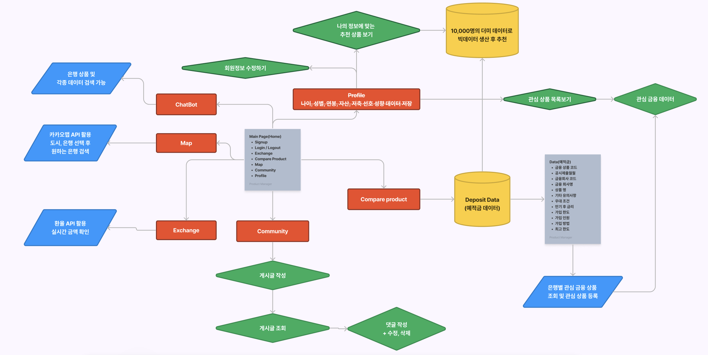

##### ERD

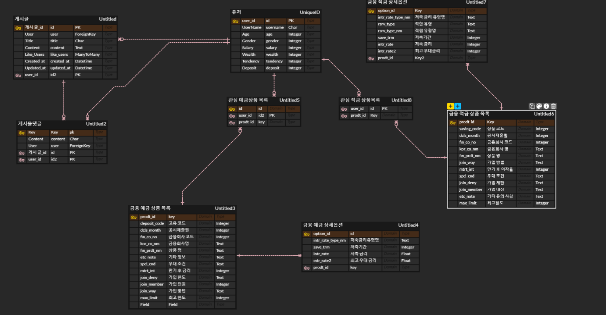

### API 명세서

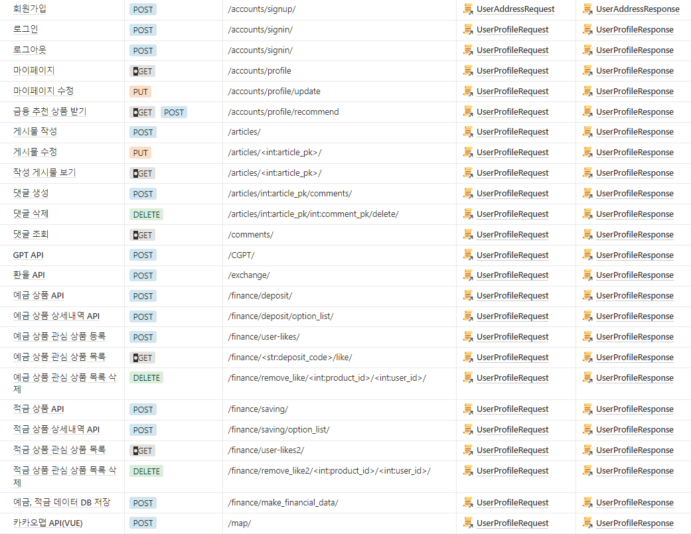

---

## 5월 16일 (목)

- 프로젝트 기획 및 ERD 작성

- 로그인 / 로그아웃 기능 구현 및 DB 저장

- 업무 분담 및 페이지 기본 틀 구성

- API키 발급 후 데이터 수집

#### 문제점 개선 및 논의 사항

첫 프로젝트인 만큼 프론트와 백을 확실히 나눠서 하기보다는 각자의 역할을 적절히 분배하여 프로젝트를 진행함. 세부적인 일정을 미리 정해두지 않고 적절히 수정해 갈 수 있는 애자일 방법론을 사용함

---

### 5월 17일 (금)

- 컴포넌트 작성 및 회원가입 페이지 완성

- 환율 API 정보 받아와 환율에 따른 값 받기

---- -

### 5월 18일 (토)

- 지도 API 활용 페이지 구현

- 게시글 작성, 수정 페이지 구현

----

### 5월 19일 (일)

- 금융 API 활용, 금융 상품 데이터 저장 및 페이지 구현

- 게시물 댓글, 프로필 페이지 구현

---

### 5월 20일 (월)

- 금융 상품 데이터 활용 -> 차트 및 추천 상품 페이지 구현

- GPT API 활용, 챗봇 생성, 페이지 CSS 적용, 프로필 수정 구현 중

#### 문제점

관심 데이터를 담는 와중에, 추가는 가능했지만 데이터를 빼는 것에 어려움이 있었다... 오늘 오후를 바쳤는데 해결하지 못했다. 오늘 안에 수정을 해야한다.

----

### 5월 21일 (화)

- 상품 데이터 정보 및 차트, 장바구니 기능 구현

- 상품 추천 페이지 구현

- CSS 적용 

----

# 페이지 설명

### 회원가입

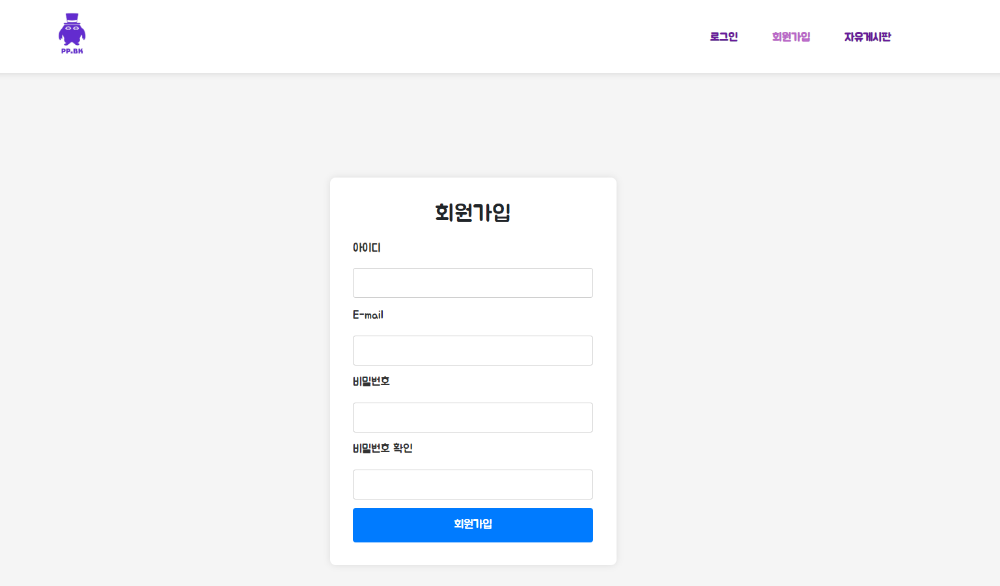

### 로그인

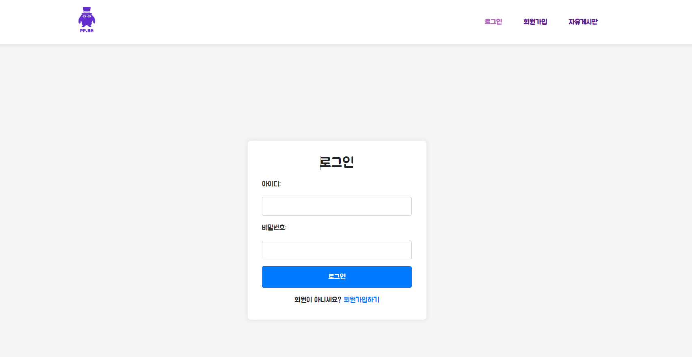

### 로그인 후 Home 화면

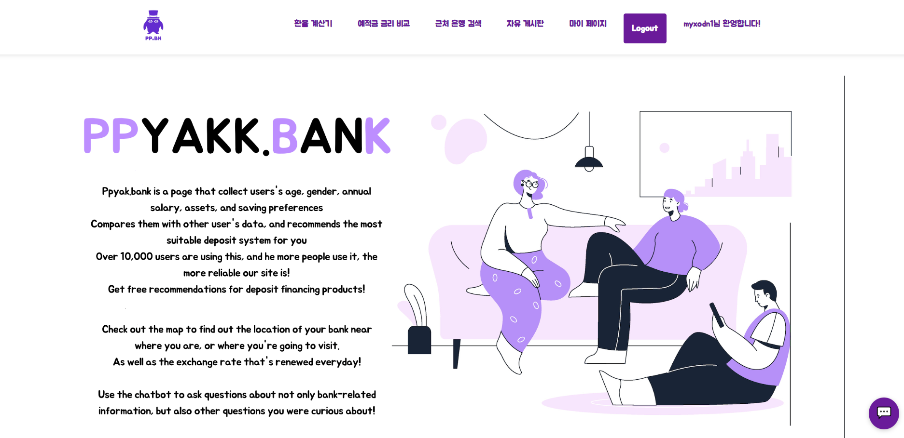

### 환율계산기

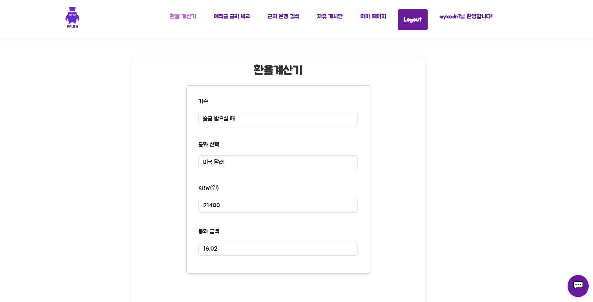

### 예적금 데이터 조회

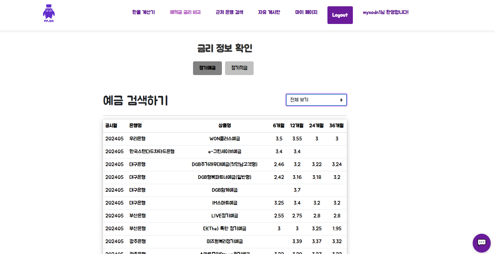

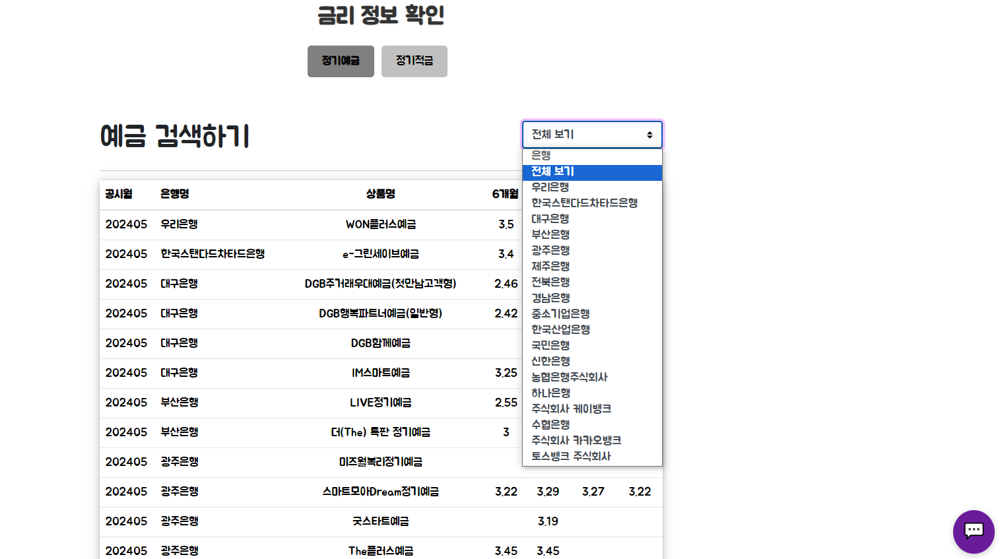

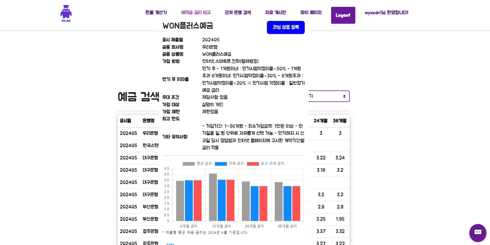 

### Map 활용 주변 은행 검색 기능

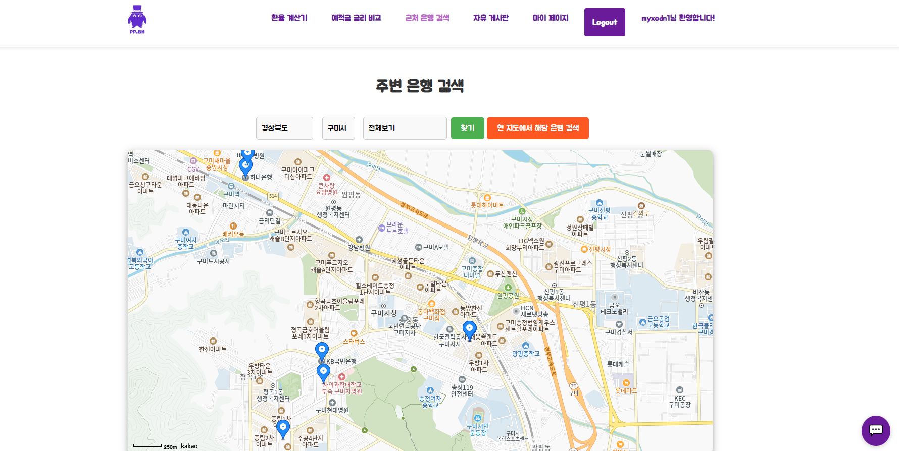

### 자유게시판

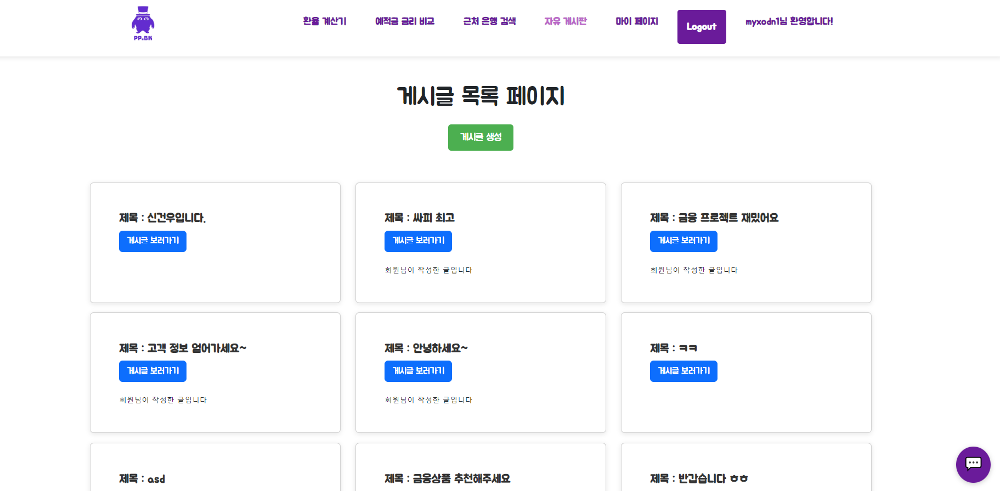

### 게시글 생성

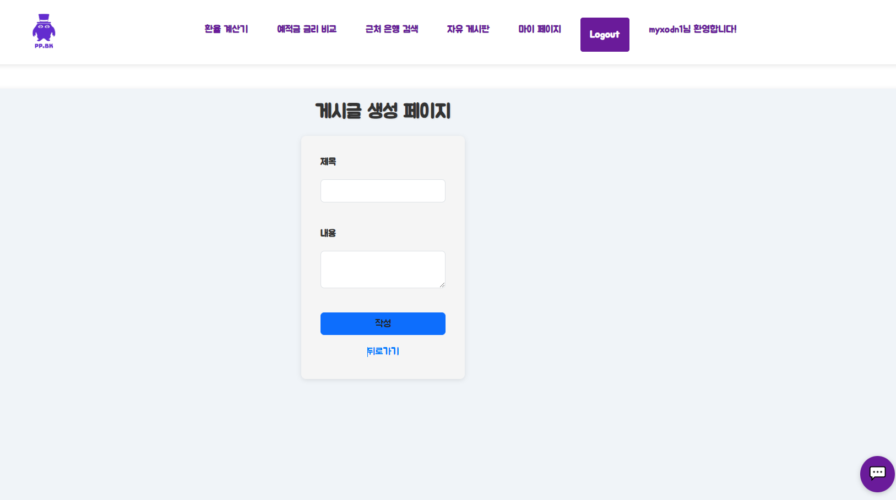

### 게시글 페이지

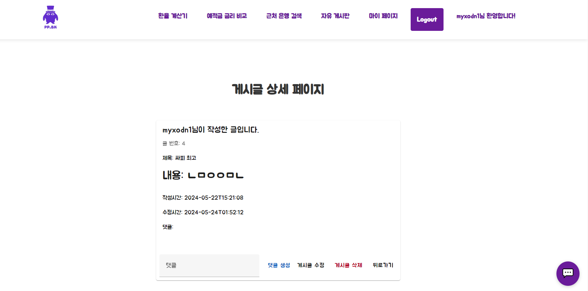

### 게시글 수정 페이지

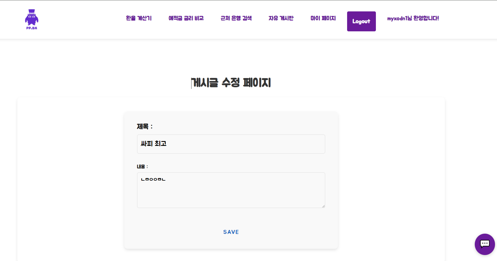

### 마이 페이지

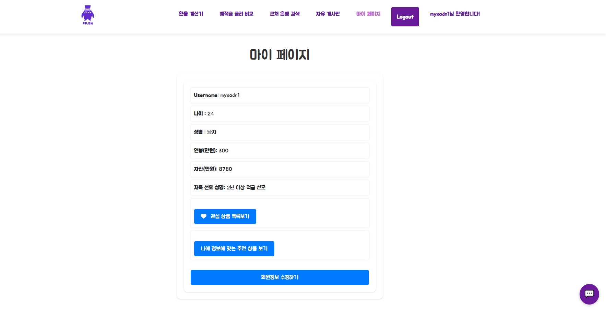

### 관심 상품 페이지

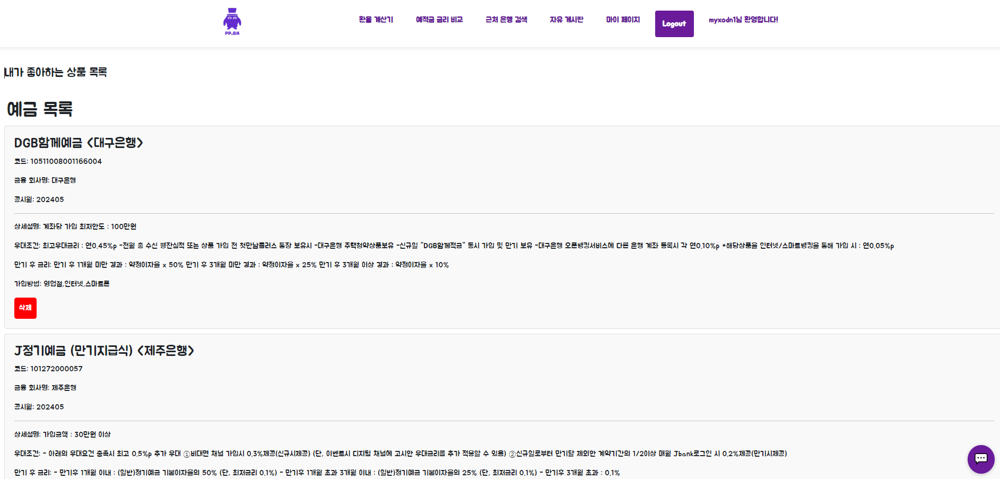

### 추천 알고리즘 상품 페이지

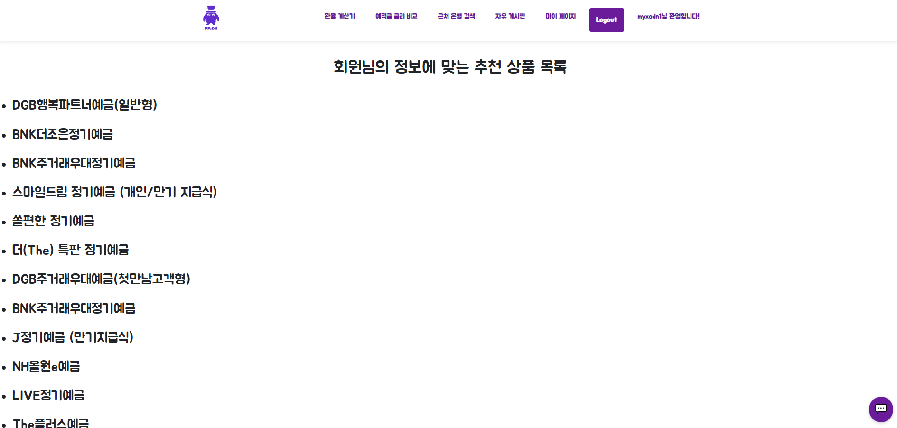

### 회원 정보 수정 페이지

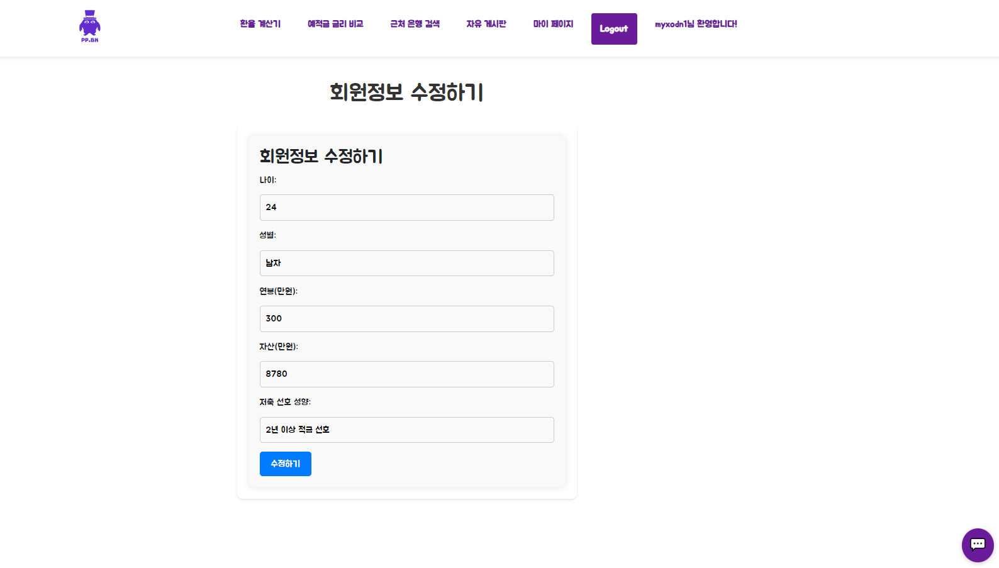

---

### 느낀점 및 후기

- 박민규 : 1학기에 배웠던 내용들을 총 정리하여 사용할 수 있는 시간이 되었습니다. 처음에 시작할때 내가 이걸 할 수 있나? 이런 생각이 들었지만 배운것들과, 자료들을 참고하여 하나하나 성실하게 쌓아가다보니 그래도 하나의 프로젝트라는 결과를 만들 수 있었습니다. 당연히 완성도 면에서 이걸 더 했으면 좋았을 걸, 하는 아쉬움이 조금은 남기는 하지만 살면서 처음 해본 프로젝트의 경험으로 참 적절했던 것 같습니다. 다음부터 더 긴 기간의 프로젝트가 주어지면 더 잘할 수 있을 것 같습니다!

- 박태우 : 평소에 강사님에게 질문을 많이하며 Django나 Vue에 관해 기본적인 지식을 어느정도 쌓은 상태였지만, 이것을 막상 새로운 맨땅에 적용을 하려고 하니 이래저래 문제가 생기는 부분이 많았습니다. 하지만 같이하는 팀원과 한 계단씩 나아가는 과정이 재미있었고, 프로젝트란 서로 간의 신뢰성, 믿음이 중요하구나 하고 느낄 수 있는 시간이 되었습니다. 마찬가지로 첫 프로젝트라 완성도 면에서는 아쉬움이 조금 남을 수 밖에는 없지만, 다음 프로젝트 기간때는 더 성장하여 훨씬 나은 모습을 보여줄 수 있을 것 같습니다!
